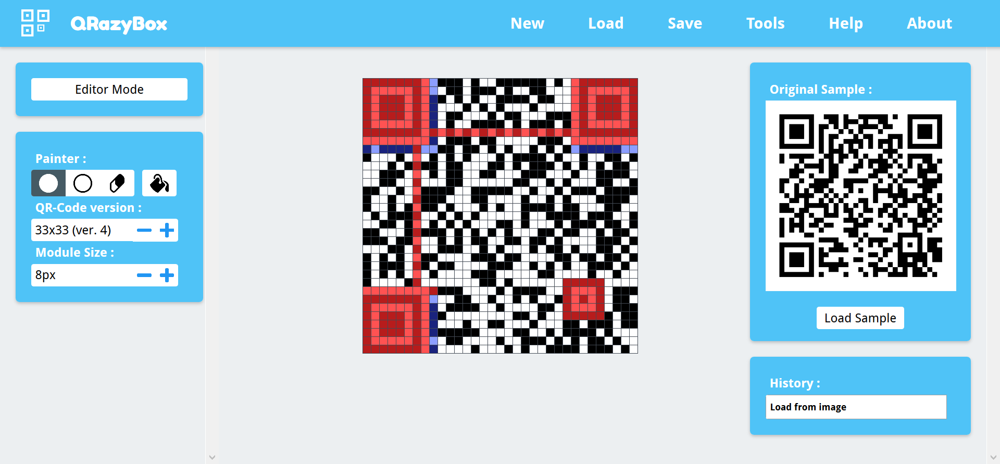

# QRazyBox

QRazyBox is a web-based application (a toolkit), that used to analyzing and recovering damaged QR Code.

QRazyBox lets you recover QR Code by redrawing and reconstructing it with Paint-like editor. It also provides several sub-tools to help you analyze and recover faster and more efficient.

Main Features
--------------------
- Reconstruct QR Code by drawing pixel by pixel
- Decode and read unscannable QR Code
- Save and load existing work for later use
- Import/export QR Code from/to Image file or Text file
- Currently support up to QR Code Version 40 (177x177)
- Support both Error and Erasure Correction using universal Reed-Solomon decoder
- Extract valuable information although from badly damaged QR Code
- Simulate data unmasking for manual data analysis
- Easy to use
- Free and open source :)

Help Usage & Documentation
---------------------
Documentation page of this tool can be accessed in following URL :

<a href="https://merricx.github.io/qrazybox/help/">https://merricx.github.io/qrazybox/help/</a>

Third-parties & References
---------------------
- <a href="http://www.thonky.com/qr-code-tutorial/">thonky.com</a>
- <a href="https://github.com/LazarSoft/jsqrcode">https://github.com/LazarSoft/jsqrcode</a> 
- <a href="https://github.com/waidotto/strong-qr-decoder">https://github.com/waidotto/strong-qr-decoder</a>
- <a href="https://en.wikiversity.org/wiki/Reed%E2%80%93Solomon_codes_for_coders">https://en.wikiversity.org/wiki/Reed–Solomon_codes_for_coders</a>
- <a href="https://markjs.io/">https://markjs.io/</a>
